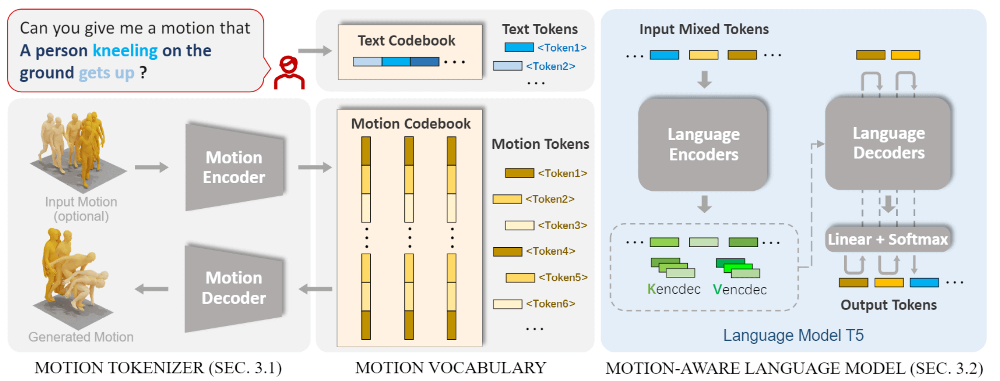

<div align= "center">
    <h1> Official repo for MotionGPT </h1>

</div>

<div align="center">
    <h2> <a href="https://motion-gpt.github.io/">MotionGPT: Human Motion as a Foreign Language</a></h2>

<p align="center">
  <a href="https://motion-gpt.github.io/">Project Page</a> •
  <a href="https://arxiv.org/abs/2306.14795">Arxiv Paper</a> •
  <a href="https://huggingface.co/spaces/OpenMotionLab/MotionGPT">HuggingFace Demo</a> •
  <a href="#️-faq">FAQ</a> •
  <a href="#-citation">Citation
</p>

</div>

<div align="center">

<!--  -->

|                                                   Teaser Video                                                   |                                                    Demo Video                                                    |
| :--------------------------------------------------------------------------------------------------------------: | :--------------------------------------------------------------------------------------------------------------: |
| <video src="https://github.com/OpenMotionLab/MotionGPT/assets/120085716/a741e162-b2f4-4f65-af8e-aa19c4115a9e" /> | <video src="https://github.com/OpenMotionLab/MotionGPT/assets/120085716/ae966d17-6326-43e6-8d5b-8562cf3ffd52" /> |

</div>

<!-- ### [MotionGPT: Human Motion as a Foreign Language](https://motion-gpt.github.io/) -->
<!-- ### [Project Page](https://motion-gpt.github.io/) | [Arxiv Paper](https://arxiv.org/abs/2306.14795) | [HuggingFace Demo](xxx) -->

## 🏃 Intro MotionGPT

MotionGPT is a **unified** and **user-friendly** motion-language model to learn the semantic coupling of two modalities and generate high-quality motions and text descriptions on **multiple motion tasks**.

<details>
    <summary><b>Technical details</b></summary>

Though the advancement of pre-trained large language models unfolds, the exploration of building a unified model for language and other multi-modal data, such as motion, remains challenging and untouched so far. Fortunately, human motion displays a semantic coupling akin to human language, often perceived as a form of body language. By fusing language data with large-scale motion models, motion-language pre-training that can enhance the performance of motion-related tasks becomes feasible. Driven by this insight, we propose MotionGPT, a unified, versatile, and user-friendly motion-language model to handle multiple motion-relevant tasks. Specifically, we employ the discrete vector quantization for human motion and transfer 3D motion into motion tokens, similar to the generation process of word tokens. Building upon this “motion vocabulary”, we perform language modeling on both motion and text in a unified manner, treating human motion as a specific language. Moreover, inspired by prompt learning, we pre-train MotionGPT with a mixture of motion-language data and fine-tune it on prompt-based question-and-answer tasks. Extensive experiments demonstrate that MotionGPT achieves state-of-the-art performances on multiple motion tasks including text-driven motion generation, motion captioning, motion prediction, and motion in-between.


</details>

## 🚩 News

- [2023/09/22] **MotionGPT got accepted by NeurIPS 2023!**
- [2023/09/11] Release the <a href="https://huggingface.co/spaces/OpenMotionLab/MotionGPT">huggingface demo</a>  🔥🔥🔥
- [2023/09/09] Release the training of MotionGPT V1.0 🔥🔥🔥
- [2023/06/20] Upload paper and init project

## ⚡ Quick Start

<details>
  <summary><b>Setup and download</b></summary>

### 1. Conda environment

```
conda create python=3.10 --name mgpt
conda activate mgpt
```

Install the packages in `requirements.txt` and install [PyTorch 2.0](https://pytorch.org/)

```
pip install -r requirements.txt
python -m spacy download en_core_web_sm
```

We test our code on Python 3.10.6 and PyTorch 2.0.0.

### 2. Dependencies

Run the script to download dependencies materials:

```
bash prepare/download_smpl_model.sh
bash prepare/prepare_t5.sh
```

For Text to Motion Evaluation

```
bash prepare/download_t2m_evaluators.sh
```

### 3. Pre-train model

Run the script to download the pre-train model

```
bash prepare/download_pretrained_models.sh
```

### 4. (Optional) Download manually

Visit [the Google Driver](https://drive.google.com/drive/folders/10s5HXSFqd6UTOkW2OMNc27KGmMLkVc2L) to download the previous dependencies.

Visit [the Hugging Face](https://huggingface.co/OpenMotionLab) to download the pretrained models.

</details>

## ▶️ Demo

<details>
  <summary><b>Webui</b></summary>

Run the following script to launch webui, then visit [0.0.0.0:8888](http://0.0.0.0:8888)

```
python app.py
```

</details>

<details>
  <summary><b>Batch demo</b></summary>

We support txt file input, the output motions are npy files and output texts are txt files. Please check the `configs/assets.yaml` for path config, TEST.FOLDER as output folder.

Then, run the following script:

```
python demo.py --cfg ./configs/config_h3d_stage3.yaml --example ./demos/t2m.txt
```

Some parameters:

- `--example=./demo/t2m.txt`: input file as text prompts
- `--task=t2m`: evaluation tasks including t2m, m2t, pred, inbetween

The outputs:

- `npy file`: the generated motions with the shape of (nframe, 22, 3)
- `txt file`: the input text prompt or text output
</details>

## 💻 Train your own models

<details>
  <summary><b>Training guidance</b></summary>

### 1. Prepare the datasets

1. Please refer to [HumanML3D](https://github.com/EricGuo5513/HumanML3D) for text-to-motion dataset setup.

2. Put the instructions data in `prepare/instructions` to the same folder of HumanML3D dataset.

### 2.1. Ready to train motion tokenizer model

Please first check the parameters in `configs/config_h3d_stage1.yaml`, e.g. `NAME`,`DEBUG`.

Then, run the following command:

```
python -m train --cfg configs/config_h3d_stage1.yaml --nodebug
```

### 2.2. Ready to pretrain MotionGPT model

Please update the parameters in `configs/config_h3d_stage2.yaml`, e.g. `NAME`,`DEBUG`,`PRETRAINED_VAE` (change to your `latest ckpt model path` in previous step)

Then, run the following command to store all motion tokens of training set for convenience

```
python -m scripts.get_motion_code --cfg configs/config_h3d_stage2.yaml
```

After that, run the following command:

```
python -m train --cfg configs/config_h3d_stage2.yaml --nodebug
```

### 2.3. Ready to instruct-tuning MotionGPT model

Please update the parameters in `configs/config_h3d_stage3.yaml`, e.g. `NAME`,`DEBUG`,`PRETRAINED` (change to your `latest ckpt model path` in previous step)

Then, run the following command:

```
python -m train --cfg configs/config_h3d_stage3.yaml --nodebug
```

### 3. Evaluate the model

Please first put the tained model checkpoint path to `TEST.CHECKPOINT` in `configs/config_h3d_stage3.yaml`.

Then, run the following command:

```
python -m test --cfg configs/config_h3d_stage3.yaml --task t2m
```

Some parameters:

- `--task`: evaluation tasks including t2m(Text-to-Motion), m2t(Motion translation), pred(Motion prediction), inbetween(Motion inbetween)

Due to the python package conflit, the released implement of linguistic metrics in motion translation task is by [nlg-metricverse](https://github.com/disi-unibo-nlp/nlg-metricverse), which may not be consistent to the results implemented by [nlg-eval](https://github.com/Maluuba/nlg-eval). We will fix this in the future.

</details>

## 👀 Visualization

<details>
  <summary><b>Render SMPL</b></summary>

### 1. Set up blender - WIP

Refer to [TEMOS-Rendering motions](https://github.com/Mathux/TEMOS) for blender setup, then install the following dependencies.

```
YOUR_BLENDER_PYTHON_PATH/python -m pip install -r prepare/requirements_render.txt
```

### 2. (Optional) Render rigged cylinders

Run the following command using blender:

```
YOUR_BLENDER_PATH/blender --background --python render.py -- --cfg=./configs/render.yaml --dir=YOUR_NPY_FOLDER --mode=video
```

### 2. Create SMPL meshes with:

```
python -m fit --dir YOUR_NPY_FOLDER --save_folder TEMP_PLY_FOLDER --cuda
```

This outputs:

- `mesh npy file`: the generate SMPL vertices with the shape of (nframe, 6893, 3)
- `ply files`: the ply mesh file for blender or meshlab

### 3. Render SMPL meshes

Run the following command to render SMPL using blender:

```
YOUR_BLENDER_PATH/blender --background --python render.py -- --cfg=./configs/render.yaml --dir=YOUR_NPY_FOLDER --mode=video
```

optional parameters:

- `--mode=video`: render mp4 video
- `--mode=sequence`: render the whole motion in a png image.
</details>

## ⚠️ FAQ

<details> <summary><b>Question-and-Answer</b></summary>
    
### The purpose and ability of MotionGPT
<details>
    <summary>The motivation of MotionGPT.</summary>

**Answer:** We present MotionGPT **to address various human motion-related tasks within one single unified model**, by unifying motion modeling with language through a shared vocabulary. To train this unified model, we propose **an instructional training scheme under the protocols for multiple motion-language**, which further reveals the potential of Large Language Models (LLMs) in motion tasks beyond the success of language generation. However, it is non-trivial for this combination since it needs to model and generate two distinct modes from scratch. Contrary to the previous work leveraging CLIP to extract text embedding as motion generation conditions, like T2M-GPT, MotionGPT introduces **the motion-language pre-training on LLM** so it can leverage the strong language generation and zero-shot transfer abilities of pre-trained language models, as well as generates human language and motion in a unified model.

</details>

<details>
    <summary>Instruction tuning and zero-shot learning.</summary>


**Answer:** We propose instruction tuning to **train a single MotionGPT across all motion-related tasks**, while task-specific tuning is to train and evaluate MotionGPTs on a single task. We employ these two training schemes to study the ability of MotionGPT across multi-tasks. As shown in this figure, we provide **zero-shot cases**. Benefitting from strong language models, MotionGPTs can understand unseen works in the text-to-motion training set, like "**scuttling**" and "**barriers**", and generate correct motions based on the meaning of sentences. However, it still struggles to generate **unseen motions**, like gymnastics, even if MotionGPTs understand the text inputs.

</details>

<details>
    <summary> In view of the recent success of LLMs, MotionGPT should pay attention to unifying current available datasets to exploit the scalable potential of language models when processing large-scale data besides increasing model size.</summary>

**Answer:** We have faced this **limited dataset issue** while implementing MotionGPT and in our further research. It is a hard but valuable work to unify and collect a larger motion dataset. Fortunately, some researchers are working on this problem, as seen in recent work like [Motion-X](https://motion-x-dataset.github.io/) and other datasets, which hold promise for advancing large-scale motion models. We intend to further evaluate MotionGPT on these larger datasets once they become available.

</details>

<details>
    <summary>How well MotionGPT learns the relationship between motion and language?</summary>


**Answer:** **Unlike** the previous motion generators using the **text encoder of CLIP** for conditions, please note that MotionGPTs leverage language models to learn the motion-language relationship, instead of relying on text features from CLIP. According to our zero-shot results (cf. **Fig. 12**) and performances on multi-tasks (cf. **Fig. 10**), MotionGPTs establish robust connections between simple/complex texts and simple motions in evaluations, but they fall short when it comes to complex-text to **complex motion translation**.

</details>

### More technical details

<details>
    <summary>Why choose T5, an encoder-decoder architecture, as the base model? How about a decoder-only model, like LLaMA?</summary>


**Answer:** The **first language model that we used** to build MotionGPTs is **LLaMA-13B**. However, it shows insufficient performance and low training efficiency. We assume the reason is the limited dataset size compared to the large parameters and language data of LLaMA. We tried a smaller size decoder-only backbone **GPT2-Medium** and provide the results in **Tab. 15**. Then, we thus chose **T5-770M**, a small but common language model, as our final backbone, because many previous vision-language multimodal works, like **Unified-IO** and **BLIP**, have chosen T5, this encoder-decoder architecture. It shows a strong power to address multi-modal tasks. In addition, the decoder-only model has the advantage for self-supervised without pair data while we have paired data which this advance is greatly weakened. We are still working on collecting a large motion dataset for larger motion-language models.

</details>

<details>
    <summary>How to merge the text vocab and motion vocab in detail? concatenating them together?</summary>

**Answer:** To ensure **a shared distribution between language and motion**, we initialize the motion tokens separately and concatenate them alongside the language tokens. This step ensures a balanced representation that encompasses both modalities. Besides the token embeddings are actively trained during the entirety of **stages 2 and 3**, ensuring a comprehensive fusion of language and motion knowledge.

</details>

<details>
    <summary>For tuning on each task, tune the entire model or just part of it?</summary>

**Answer:** To address individual tasks, we adopt a focused approach where the entire model is fine-tuned. Our rationale lies in the fact that, for each specific task, our emphasis is on optimizing task-specific performance, without retaining an excessive amount of intelligence learned from other tasks. Besides, we only exclusively fine-tune the text-to-motion task, while other tasks are reported without specific tuning.

</details>

### More experimental details

<details>
    <summary>Can MotionGPT perform motion editing or motion composition similar to MotionDiffuse and MDM?</summary>

| Method               | FID $\downarrow$ | DIV $\rightarrow$ | ADE $\downarrow$ | FDE $\downarrow$ |
| :------------------- | :--------------- | :---------------- | :--------------- | :--------------- |
| Real                 | 0.002            | 9.503             | -                | -                |
| MDM                  | 6.031            | 7.813             | 5.446            | 8.561            |
| T2M-GPT              | 2.056            | 8.635             | 6.161            | 8.302            |
| **MotionGPT (Ours)** | **0.905**        | **8.972**         | **4.745**        | **6.040**        |

**Comparison of motion prediction on HumanML3D dataset using motion data only.**

**Answer:** Referring to MDM, motion editing has two categories: **body part editing** and **motion completion** in the temporal domain. MotionGPT is capable of the latter, which includes **motion prediction** and **motion in-between**. It outperforms both **MDM** and **T2M-GPT** in the table above. However, when it comes to body part editing, the vector quantization(VQ)-based methods, like MotionGPT and T2M-GPT, are not as suitable as diffusion-based models that utilize diffusion inpainting on raw motion data. Editing body parts with LLM and prompts is a promising direction but still needs exploration.

</details>

<details>
    <summary>How to implement the MDM on the motion prediction and in-between tasks?</summary>

**Answer:** Please follow the approach outlined in **Appendix B.4** and **Line-296** of our paper, where we highlight that MDM achieves the motion in-between task using a masked motion "in-painting" technique. Specifically, this involves fixing the initial and final portions of the motion and allowing the model to generate the central portion. To adapt this concept for motion prediction, we similarly fix a portion of the motion – in our case, **the first 20%** – and generate the subsequent sequence.

</details>

<details>
    <summary> Motion down-sample, if only given a start frame and an end frame as the in-between input, would the model perform well?</summary>

**Answer:** VQ-based methods, such as MotionGPT and T2M-GPT, employ downsampling tricky to enhance the density of the codebook or tokens and reduce computing costs. This indeed becomes a constraint when the operation granularity is smaller than the down-sample rate. However, to address this issue, only the start and end frames are provided as in-between inputs. Some technical tricks can be used, such as repeating a single start or end frame up to the window size as inputs and removing the redundant parts in outputs. This does not significantly impact the effectiveness of the model, as there are often static beginnings or endings in the ground truth (GT) motion data.

</details>

<details>
    <summary>How is the down-sample rate chosen? It is a fundamental hyper-parameter that decides the overall granularity of the model.</summary>
    
| Downsampling | MPJPE $\downarrow$ | MPJPE $\downarrow$ | ACCL $\downarrow$ | FID $\downarrow$ | DIV $\rightarrow$ |
| ------------ | ------------------ | ------------------ | ----------------- | ---------------- | ----------------- |
| $l=1$        | 76.2               | 49.5               | 19.5              | 0.421            | 9.613             |
| $l=2$        | **52.6**           | **37.7**           | **9.5**           | 0.135            | 9.722             |
| $l=4$        | 55.8               | 40.1               | 7.5               | **0.067**        | 9.675             |
| $l=8$        | 62.7               | 45.3               | 8.7               | 0.223            | **9.584**         |

**Answer:** We selected the down-sample rate based on the frames-per-second (FPS) of the HumanML3D and KIT-ML datasets, which is **20 fps**. Therefore, down-sampling by a factor of 4 to achieve **5 fps** can ensure distinctiveness in motion frames, and prevents redundancy, and acceleration training. This choice was also made to ensure a fair comparison, as we utilized the same down-sample rate as T2M-GPT. As shown in the above table, we provide an ablation study on these parameters, where a factor of 4 achieves the best Frechet Inception Distance (FID) in motion reconstructions.

</details>

<details>
    <summary> Failure analysis. Zero-shot ability to handle words that have semantic meaning but could be unseen.</summary>


**Answer:** As shown in **Fig. 12**, we provide both **zero-shot cases** and **failure cases**. Benefitting from strong language models, MotionGPTs can understand unseen works in the text-to-motion training set, like "**scuttling**" and "**barriers**", and generate correct motions based on the meaning of sentences. However, it still struggles to generate unseen motions, like gymnastics, even if MotionGPTs understand the text inputs.

</details>

<details>
    <summary> Do TM2T, T2M, and poseGPT capture all human motion in their training dataset's discrete latent code?</summary>

| Method           | MPJPE$\downarrow$ | MPJPE $\downarrow$ | ACCL $\downarrow$ | FID $\downarrow$ | DIV $\rightarrow$ |
| ---------------- | ----------------- | ------------------ | ----------------- | ---------------- | ----------------- |
| VPoser-t         | 75.6              | 48.6               | 9.3               | 1.430            | 8.336             |
| ACTOR            | 65.3              | 41.0               | **7.0**           | 0.341            | **9.569**         |
| MLD-1            | **54.4**          | 41.6               | 8.3               | 0.247            | 9.630             |
| MotionGPT (Ours) | 55.8              | **40.1**           | 7.5               | **0.067**        | 9.675             |

**Motion reconstruciton comparision.**

| Method           | FID $\downarrow$               |
| ---------------- | ------------------------------ |
| MotionGPT (Ours) | $0.510^{\pm.016}$              |
| T2M-GPT          | $0.514^{\pm.029}$              |
| MLD              | $\boldsymbol{0.404}^{\pm.027}$ |

**Comparison of FID in text-to-motion task on KIT-ML dataset.**

**Answer:** Given sufficient training or testing data from the same dataset, motion reconstruction is not a challenging task for both VAE and VQ-VAE. We have provided the evaluation on motion reconstruction in **Tab.8**. However, when dealing with a **limited amount of motion data**, like the KIT dataset, **the VAE model shows better ability in motion interpolation, surpassing VQ-VAE**.
A relevant evaluation is shown above (also in **Tab.7**), where MLD (VAE) outperforms MotionGPT and T2M-GPT (VQ-VAEs) on FID.
The real challenge lies in reconstructing complex motions, such as diving or gymnastics sports. Existing motion generators struggle to accurately reconstruct **complex motions** using a codebook extracted from daily motion datasets. Collecting these complex yet valuable motions is still a significant challenge to the motion research community.

</details>

### About performances

<details>
    <summary> Motion quality and performance gain.</summary>

| Method    | FID $\downarrow$               |
| :-------- | :----------------------------- |
| MDM       | $0.544^{\pm.044}$              |
| MotionGPT | $0.160^{\pm.008}$              |
| T2M-GPT   | $\boldsymbol{0.116}^{\pm.004}$ |

**Comparison of FID in text-to-motion task on HumanML3D dataset.**

| Method    | FID $\downarrow$               |
| :-------- | :----------------------------- |
| T2M-GPT   | $0.514^{\pm.029}$              |
| MotionGPT | $0.510^{\pm.016}$              |
| MDM       | $\boldsymbol{0.497}^{\pm.021}$ |

**Comparison of FID in text-to-motion task on KIT-ML dataset.**

**Answer:** The FID metrics primarily focus on the motion quality rather than the correlation between motion and text. While MDM serves as a successful benchmark for motion generation, both MotionGPT and T2M-GPT outperform MDM by a margin of 0.38~0.43 on the FID scale. **However**, **the difference in motion quality among these three works is not significant in video supply**. Additionally, MDM outperforms two vector quantized methods, MotionGPT and T2M-GPT, in terms of FID on the KIT dataset. This can be attributed to the limited number of 3,911 motion sequences, which makes it **challenging to construct a comprehensive motion codebook**. More importantly, MotionGPT contributes to multiple motion tasks with LLM, particularly in generating both text and motion within a single model, rather than aiming to improve the FID metric.

</details>

<details>
    <summary>Limited performance gain with strong language models.</summary>

**Answer:** We thought MotionGPT, using a **significantly larger language model**, would surpass all existing methods in all tasks. **However**, the evaluation shows MotionGPT achieves SOTA results in 18 out of 23 metrics, where many improvements are only small gains. This can be attributed to the limited size of the dataset. Both **HumanML3D (14,616 motions) and KIT (3,911 motions)** are **limited** in vocabulary size and overall dataset size, particularly when compared to billion-level language datasets, which affects the efficacy of large-scale models. Benefitting from recent dataset works, like [Motion-X](https://motion-x-dataset.github.io/), we will evaluate the performance gain of MotionGPT in larger datasets once they become available.

</details>

<details>
    <summary> Performance Gain on R-Precision in KIT.</summary>

**Answer:** The evaluation of R-Precision in the KIT dataset relies on the text encoder, which is built using a limited set of 6,353 textual descriptions. In contrast, MotionGPTs benefit from LLM and large language data, enabling them to **generate longer and more natural language descriptions** for motion. However, this leads to **a discrepancy between the generated descriptions and the GT descriptions**, resulting in a lower R-Precision.

</details>

<details>
    <summary> MotionGPT seems to sacrifice accuracy in exchange for additional functionalities.</summary> 


**Answer:** As shown in **Fig. 10**, MotionGPT achieves SOTA on **18 out of 23** metrics across four motion-related tasks. Additionally, both HumanML3D and KIT are limited in overall dataset size, particularly when compared to billion-level language datasets. This affects the efficacy of large-scale models. We will further employ a larger motion-text dataset to evaluate MotionGPT. Besides, MotionGPTs introduce motion-language pre-training, as well as its zero-shot ability, which is a promising direction worth exploring and could stimulate self-training procedures for further research.

</details>

### About illustrations

<details>
    <summary>Visualize some of the tokens in the vocabulary that VQ-VAE learned.</summary>


**Answer:** As shown in **Fig.13**, we visualize these **motion tokens** in **motion vocabulary $V_m$** and their corresponding localized spatial-temporal contexts, depicted within **4-frame motion segments**. However, MotionGPT falls short in generating descriptions for each individual token, as the training is conducted on token sequences.

You can run the script below to visualize more tokens:

```
python -m scripts.get_code_visual --cfg configs/config_h3d_stage2.yaml
```

</details>
</details>

## 📖 Citation

If you find our code or paper helps, please consider citing:

```bibtex
@article{jiang2024motiongpt,
  title={Motiongpt: Human motion as a foreign language},
  author={Jiang, Biao and Chen, Xin and Liu, Wen and Yu, Jingyi and Yu, Gang and Chen, Tao},
  journal={Advances in Neural Information Processing Systems},
  volume={36},
  year={2024}
}

@inproceedings{chen2023executing,
  title={Executing your Commands via Motion Diffusion in Latent Space},
  author={Chen, Xin and Jiang, Biao and Liu, Wen and Huang, Zilong and Fu, Bin and Chen, Tao and Yu, Gang},
  booktitle={Proceedings of the IEEE/CVF Conference on Computer Vision and Pattern Recognition},
  pages={18000--18010},
  year={2023}
}
```

## Acknowledgments

Thanks to [Motion-latent-diffusion](https://github.com/ChenFengYe/motion-latent-diffusion), [T2m-gpt](https://github.com/Mael-zys/T2M-GPT), [TEMOS](https://github.com/Mathux/TEMOS), [ACTOR](https://github.com/Mathux/ACTOR), [HumanML3D](https://github.com/EricGuo5513/HumanML3D) and [joints2smpl](https://github.com/wangsen1312/joints2smpl), our code is partially borrowing from them.

## License

This code is distributed under an [MIT LICENSE](LICENSE).

Note that our code depends on other libraries, including SMPL, SMPL-X, PyTorch3D, and uses datasets which each have their own respective licenses that must also be followed.
